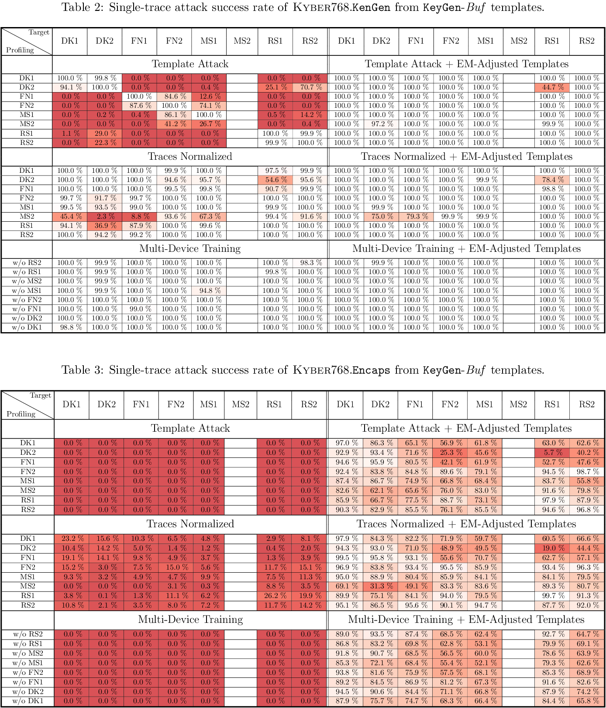
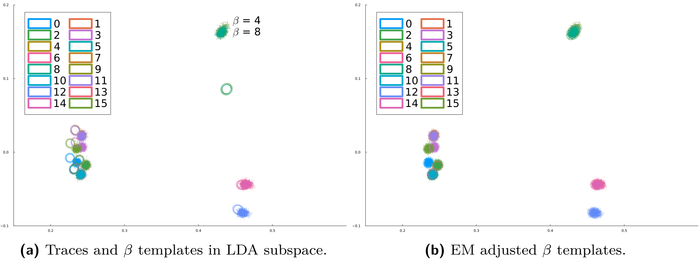
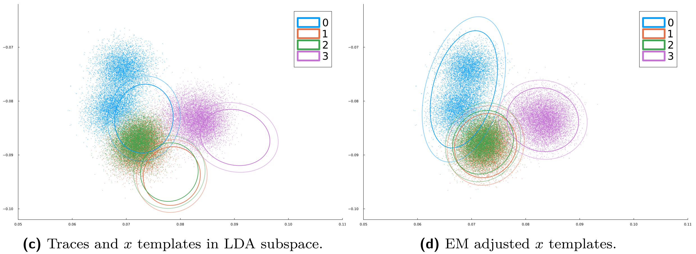

#

This repository contains the [Julia](https://julialang.org/) code
needed for reproducing the experiments described in our paper

>Eric Chun-Yu Peng, Markus G. Kuhn: Adaptive Template Attacks on the
Kyber Binomial Sampler. [IACR Transactions on Cryptographic Hardware
and Embedded Systems](https://tches.iacr.org/), Vol. 2025, No. 3.

## Install Julia

To run this code, you will need [Julia](https://julialang.org/)
(version 1.11 or newer).

For Linux or macOS, best [install
Julia](https://julialang.org/downloads/) via the
[juliaup](https://github.com/JuliaLang/juliaup/blob/main/README.md)
installation manager, using the following shell command line:

```
$ curl -fsSL https://install.julialang.org | sh
```

## Download this repository
Clone this repository and its submodules to your local machine, then install
(“instantiate”) the required Julia package dependencies for this project
into your Julia depot path (default: `~/.julia/`):
```
$ git clone --recursive https://github.com/eric-cyp24/Kyber768cbd.jl.git
$ cd Kyber768cbd.jl
$ julia --project -e "import Pkg; Pkg.instantiate()"
```


## Download trace data for DK2 and MS2

This repository contains only Julia code. To reproduce some of the
experiments from the paper, you also need to separately download the
data used.

The following Julia script will download (4000+2×1000)×48 raw 100 MHz
traces for two devices (4000 to profile DK2 and 1000 each to attack
`KeyGen` (K) and `Encaps` (E) on MS2). It will also download pre-built
post-LDA templates for the other devices.

The script will download this data into the folder `data/` (into
subfolder `Traces/`), unless you specify another folder using the
environment variable `DATA_DIR`. This folder will later also be used
for temporary data.

Chose one of the following options, depending on how much disk space
you have:

<ul>

<li>Option 1: download all required data (for profiling and attack) at
once

```
$ julia --project scripts/downloaddata.jl                # requires 30 GB
```

<li>Option 2: download data needed for profiling and attack seperately

You can also download the required datasets for each of the following
steps individually and remove them after the corresponding processing
step. This reduce the required disk space down to **17 GB**.

```
$ julia --project scripts/downloaddata.jl --profiling    # requires 7.5 GB
$ julia --project scripts/downloaddata.jl --attack       # requires 4.6 GB
```

</ul>

The above allows you to reproduce all the attacks against the MS2 device,
as well as the profiling steps for the DK2 device.

## Optional: download results for other target devices than MS2

You can also download the profiling and attack outcomes,
including all the LDA projections and adjusted template parameters for
all the other profiling and target device combinations:

```
$ julia --project scripts/downloaddata.jl --results      # requires 17 GB
```

## Build tables 2 and 3

You can run the following Julia script to generate the LaTeX table source code
for tables 2 and 3, and `pdflatex` to generate the table below as
`results/SuccessRateTables.pdf`.

```
$ julia --project scripts/h5result2latextable_multiboardsingletrace.jl
$ pdflatex -output-directory results scripts/SuccessRateTables.tex
```

If you downloaded the results for other target devices than MS2 you
should see these tables:



Note that the MS2 columns are still missing.

To complete those:
- First, build the DK2 profiling templates with the following profiling step.
- Then, run the single-trace attacks on the MS2 target with templates from all
  devices (DK1–RS2).


## Profiling

Build the LDA-based templates from profiling traces of device DK2:
`data/Traces-pub/SOCKET_HPF/DK2/test_20241219/lanczos2_25/traces_lanczos2_25_proc.h5`.
The resulting templates will be stored in the folder
`data/Traces-pub/SOCKET_HPF/DK2/test_20241219/lanczos2_25/Templates_POIe40-80/`.

```
$ julia --project scripts/downloaddata.jl --profiling
$ julia --project scripts/profiling_kyber768cbd.jl
```


## Single-trace attacks

Run the single-trace attacks on the MS2 target device:
```
$ julia --project scripts/downloaddata.jl --attack
$ julia --project scripts/attack_kyber768cbd_Buf_singletrace.jl
```
You can speed up the attack by running Julia with multiple threads:
```
$ julia --project -t4 scripts/attack_kyber768cbd_Buf_singletrace.jl
```
Option `-t4` tells Julia to execute with 4 threads.
Adjust this based on your computer's resources, i.e. speed up the
computation with more threads or decrease RAM usage with fewer.
Each attack trace set (table cell) takes 3–15 minutes to finish.
Therefore, this script may run for a while (roughly 5 h on
my computer).

The attack results will be stored as HDF5 files in folder
`data/Traces/SOCKET_HPF/MS2/test_20241221/lanczos2_25_test_K/Results/Templates_POIe40-80/`.

To see more detailed attack metadata, use an HDF5 viewer, e.g.
[HDFView Software](https://www.hdfgroup.org/download-hdfview/) or
[myHDF5 online viewer](https://myhdf5.hdfgroup.org/); or open the file
directly with the [HDF5.jl package](https://juliaio.github.io/HDF5.jl/stable/)
in Julia:
```
$ julia
julia> using HDF5
julia> resulth5 = h5open("data/path/to/result.h5")
```

### Attacking the Encaps operation

To attack the Encaps operation (Table 3 above), run the same attack
script with the additional command line argument: `--targetOP Encaps`
```
$ julia --project scripts/attack_kyber768cbd_Buf_singletrace.jl --targetOP Encaps
```


## Generate (LaTeX) tables
To view the single-trace attack results, run the following code (again) to
generate the `results/SuccessRateTables.pdf` with the newly produced success
rates:
```
$ julia --project scripts/h5result2latextable_multiboardsingletrace.jl
$ pdflatex -output-directory results scripts/SuccessRateTables.tex
```


## Adaptive template attack evaluation


To view the effect of the EM-based template adjustment, run the following
script:
```
$ julia --project scripts/figure_emadj_templates.jl --variable XY --output results/traces_and_XY_templates.png
```
to generate the before-and-after figures as shown above. The two figures
will be stored in the `results/` folder as the
`traces_and_XY_templates.png` and `traces_and_XY_templates_EMadj.png`
files.

If you want to see the effect of EM template adjustment on a lower-leakage
intermediate variable (iv), modify the command line options for the script:
```
$ julia --project scripts/figure_emadj_templates.jl --variable X --output results/traces_and_X_templates.png
```
You should now see the two new figures: `traces_and_XY_templates.png` and
`traces_and_XY_templates_EMadj.png`, also in the `results/` folder, similar
to the ones shown below.



