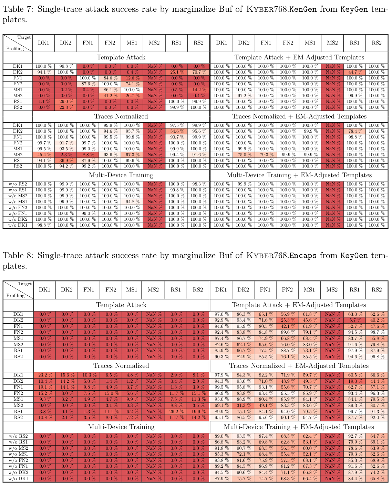
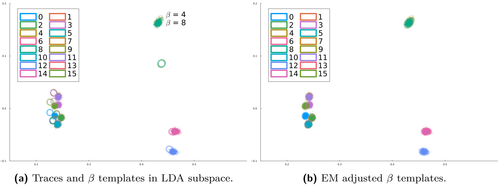
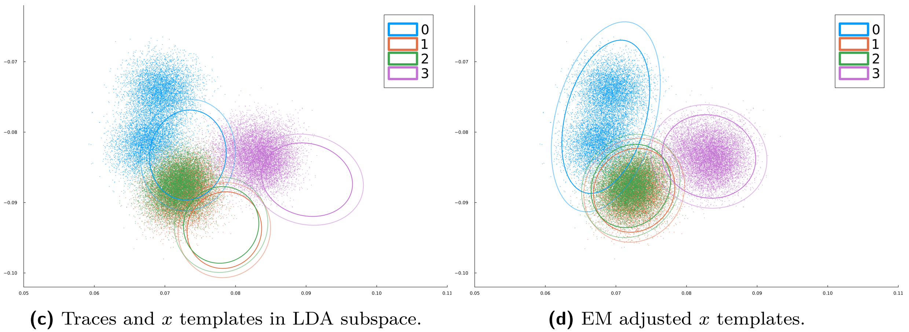

## Install Julia
Follow the [Julia installation](https://julialang.org/downloads/)
guide to install [Julia](https://docs.julialang.org/en/v1.11/manual/getting-started/).
For Mac and Linux, Julia can be installed by the following command:
```
$ curl -fsSL https://install.julialang.org | sh
```


## Download this repository
Clone this repository and its submodules to your local machine, then install
(instantiate) the required Julia dependencies for this project:
```
$ git clone --recursive https://github.com/eric-cyp24/Kyber768cbd.jl.git
$ cd Kyber768cbd.jl
$ julia --project -e "import Pkg; Pkg.instantiate()"
```


## Download data
Download the pre-built templates from all devices (DK1, FN1 - RS2) except for DK2,
profiling traces from DK2, and attack traces from MS2. The two MS2 attack trace sets
are from both KeyGen and Encaps operations, each with postfix `_test_K` and `_test_E`,
respectively.
The data will be downloaded into the folder: `data/Traces/`.\
\* Note that, the **dataset size is about 30GB**, please make sure you have
enough disk space left.
```
$ julia --project scripts_pub/downloaddata.jl
```
\* Or you can download the required datasets for each following step individually
and remove them afterward, which would reduce storage requirement down to **17GB**.
```
$ julia --project scripts_pub/downloaddata.jl --profiling    # require 7.5GB
$ julia --project scripts_pub/downloaddata.jl --attack       # require 4.6GB

## optional: attack results from other target devices ##
$ julia --project scripts_pub/downloaddata.jl --Results      # require 17GB
```
Run the following Julia script to generate LaTeX table source code. Then, use the
`pdflatex` tool to generate the table below as the `results/SuccessRateTables.pdf`
file.
```
$ julia --project scripts_pub/h5result2latextable_multiboardsingletrace.jl
$ pdflatex -output-directory results scripts_pub/SuccessRateTables.tex
```
Alternatively, you can paste the generated LaTeX codes (`results/...Success_Rate.tex`)
into a LaTeX editor, e.g. [Overleaf](https://www.overleaf.com/), and you sould see
the tables:


Note that, the MS2 columns are incomplete, thus shown as `NaN` in the tables.
You can complete the MS2 columns by:
- First, build the device DK2 templates with the following profiling step.
- Then, run the single-trace attacks on the MS2 target with templates from all
  devices (DK1 - RS2).


## Profiling
Build the LDA-based templates from device DK2's profiling traces:
`data/Traces-pub/SOCKET_HPF/DK2/test_20241219/lanczos2_25/traces_lanczos2_25_proc.h5`.
The templates will be stored in the folder:
`data/Traces-pub/SOCKET_HPF/DK2/test_20241219/lanczos2_25/Templates_POIe40-80/`.

```
$ julia --project scripts_pub/downloaddata.jl --profiling
$ julia --project scripts_pub/profiling_kyber768cbd.jl
```


## Single-trace attacks
Run the single-trace attacks on the MS2 target device:
```
$ julia --project scripts_pub/downloaddata.jl --attack
$ julia --project scripts_pub/attack_kyber768cbd_Buf_singletrace.jl
```
You can speed up the attack by running Julia with multi-thread:
```
$ julia --project -t4 scripts_pub/attack_kyber768cbd_Buf_singletrace.jl
```
The multi-thread argument `-t4` tells Julia to execute with 4 threads.
Based on your computer's hardware resources, you can either speed up the
computation by increasing the threads or decrease the number of threads to
limit the RAM usage. Each attack trace set (table cell) takes 3~15 minutes
to finish. Therefore, this script may run for a while. (Roughly *5 hr* on
my computer, so please feel free to take a long...... coffee break.) The
attack results will be stored as HDF5 files in the folder:
`data/Traces/SOCKET_HPF/MS2/test_20241221/lanczos2_25_test_K/Results/Templates_POIe40-80/`.
You can view the more detailed attacked metadata with a HDF5 viewer, e.g.
[HDFView Software](https://www.hdfgroup.org/download-hdfview/) or
[myHDF5 online viewer](https://myhdf5.hdfgroup.org/); or open the file
directly with the [HDF5.jl package](https://juliaio.github.io/HDF5.jl/stable/)
in Julia:
```
$ julia
julia> using HDF5
julia> resulth5 = h5open("data/path/to/result.h5")
```

### Attacking the Encaps operation
For attacking the Encaps operation (Table 3 above), run the same attack
script with the additional command line argument: `--targetOP Encaps`
```
$ julia --project scripts_pub/attack_kyber768cbd_Buf_singletrace.jl --targetOP Encaps
```


## Generate (LaTeX) tables
To view the single-trace attack results, run the following code (again) to
generate the `results/SuccessRateTables.pdf` with the newly produced success
rates:
```
$ julia --project scripts_pub/h5result2latextable_multiboardsingletrace.jl
$ pdflatex -output-directory results scripts_pub/SuccessRateTables.tex
```


## Adaptive template attack evaluation


To view the effect of the EM-based template adjustment, run the following
script:
```
$ julia --project scripts_pub/figure_emadj_templates.jl
```
to generate the before-and-after figures as shown above. The two figures
will be stored in the `results/` folder as the
`traces_and_templates_XY_*.png` and `traces_and_templates_EMadj_XY_*.png`
files.

If you want to see the effect of EM template adjustment on a lower-leakage
intermediate variable (iv), modify the `Parameters` section of
`scripts_pub/figure_emadj_templates.jl` by:
* changing the targeted variable `iv` from `:XY` to `:X` at line 13.
* i.e. `iv, nicvth = :XY, 0.001` &#x1F852; `iv, nicvth = :X , 0.001`

Then, run the plotting script again:
```
$ julia --project scripts_pub/figure_emadj_templates.jl
```
You should now see the two new figures below, also in the `results/` folder.



