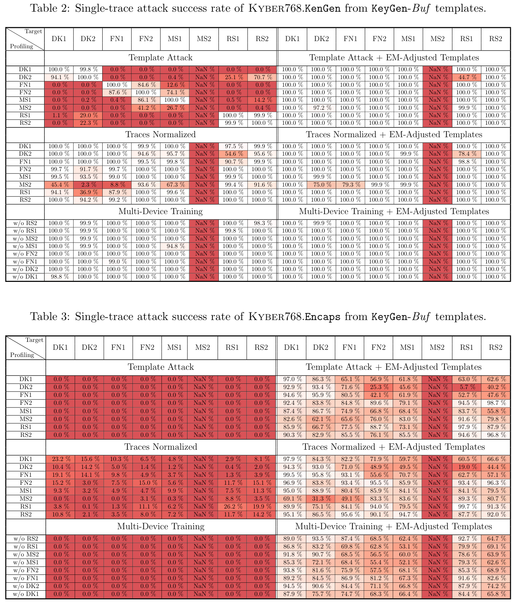

## Download this repository
Clone this repository and the submodules to your local machine:
```
$ git clone --recursive https://github.com/eric-cyp24/Kyber768cbd.jl.git
$ cd Kyber768cbd.jl
```


## Install Julia
Follow the [Julia installation](https://docs.julialang.org/en/v1/manual/installation/)
guide to install [Julia](https://docs.julialang.org/en/v1.11/manual/getting-started/).
For Mac and Linux, Julia can be installed by the following command:
```
$ curl -fsSL https://install.julialang.org | sh
```


## Download data
Download Templates from all devices (DK1 - RS2), profiling traces from DK2,
and attack traces from MS2. The data will be downloaded into the folder:
`data/Traces/`.
\* Note that, the **dataset size is about 30GB**, please make sure you have
enough disk space left.

```
$ julia --project scripts_pub/checkdata.jl
```
Run the following Julia script to generate LaTeX table source code.
```
$ julia --project scripts_pub/h5result2latextable_multiboardsingletrace.jl
```
Paste the generated LaTeX codes (`results/...Success_Rate.tex`) into a LaTeX editor,
and you sould see the tables:


Note that the MS2 columns are incomplete, thus shown as `NaN` in the tables.
You can complete the MS2 columns by:
- First, build the device DK2 templates with the following profiling step.
- Then, run the single-trace attacks on the MS2 target with templates from all
  devices (DK1 - RS2).


## Profiling
Build the LDA-based templates from device DK2's profiling traces:
`data/Traces-pub/SOCKET_HPF/DK2/test_20241219/lanczos2_25/traces_lanczos2_25_proc.npy`.
The templates will be stored in the folder:
`data/Traces-pub/SOCKET_HPF/DK2/test_20241219/lanczos2_25/Templates_POIe40-80/`.

```
$ julia --project scripts_pub/profiling_kyber768cbd.jl
```


## Single-trace attacks
Run the single-trace attacks on the MS2 target device.
```
$ julia --project -t4 scripts_pub/attack_kyber768cbd_Buf_singletrace.jl
```
Each attack traceset takes 3~15 minutes to finish, therefore, this script may
run for a while. (Please feel free to take a coffee break or go for a walk...)
The attack results will be stored in the folder:
`data/Traces/SOCKET_HPF/MS2/test_20241221/lanczos2_25_test_K/Results/Templates_POIe40-80/`.
You can view the more detailed attacked metadata from the attacks with a HDF5
viwer, for example: [myHDF5 online viewer](https://myhdf5.hdfgroup.org/)

For attacking the Encaps target, modify the `scripts_pub/attack_kyber768cbd_Buf_singletrace.jl`
script's `Parameters` section: change the `postfix` from `"_test_K"` to
`postfix = "_test_E"` at line 17. Then, run the attack again:
```
$ julia --project -t4 scripts_pub/attack_kyber768cbd_Buf_singletrace.jl
```


## Generate (LaTex) tables
To see the single-trace attack result, run the following code (again) to
generate LaTeX table source codes (`results/...Success_Rate.tex`), with
the newly produced success rates.
```
$ julia --project scripts_pub/h5result2latextable_multiboardsingletrace.jl
```
Then, paste the results to a LaTeX editor to view the updated attack result
tables.


## Adaptive template attack evaluation


To view the effect of the EM-based template adjustment, run the following
script:
```
$ julia --project scripts_pub/figure_emadj_templates.jl
```
to generate the before-and-after figures as shown above. The two figures
will be stored in the `results/` folder as the
`traces_and_templates_XY_*.png` and `traces_and_templates_EMadj_XY_*.png`
files.

If you want to see the effect of EM template adjustment on a lower-leakage
intermediate variable, modify the `scripts_pub/figure_emadj_templates.jl`
script's `Parameters` section: change the `iv` from `:XY` to
`iv, nicvth = :X , 0.001` at line 13. Then, run the plotting script again:
```
$ julia --project scripts_pub/figure_emadj_templates.jl
```
You should now see the two new figures below, also in the `results/` folder.


