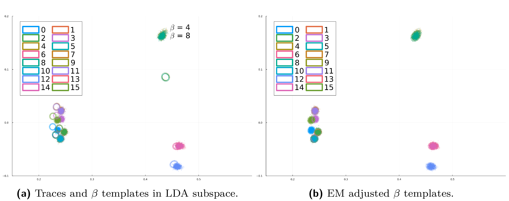

# Adaptive Template Attacks on the Kyber Binomial Sampler

[Eric Chun-Yu Peng](https://www.cl.cam.ac.uk/~cyp24/), [Markus G. Kuhn](https://www.cl.cam.ac.uk/~mgk25/)

This repository contains the [Julia](https://julialang.org/) code
needed for reproducing the experiments described in our paper

>Eric Chun-Yu Peng, Markus G. Kuhn: Adaptive Template Attacks on the
Kyber Binomial Sampler. [IACR Transactions on Cryptographic Hardware
and Embedded Systems](https://tches.iacr.org/), Vol. 2025, No. 3.

## Requirements

This code was mainly developed and tested on x86-ix64 (64-bit)
computers running Ubuntu Linux 20.04 or 24.04 with 48 GB RAM. We hope
it will run on any platform that is [supported by
Julia](https://julialang.org/downloads/#supported_platforms) and has
at least 16 GB RAM. About 25 GB disk space would be ideal, but there
are also ways to run the demo with only about 12 GB disk space.

## Install Julia

To run this code, you will need [Julia](https://julialang.org/)
(version 1.11 or newer).

For Linux or macOS, best [install
Julia](https://julialang.org/downloads/) via the
[juliaup](https://github.com/JuliaLang/juliaup/blob/main/README.md)
installation manager using the following shell command line:

```
$ curl -fsSL https://install.julialang.org | sh
```

## Download this repository
Clone this repository and its submodules to your local machine, then install
(“instantiate”) the required Julia package dependencies for this project
into your Julia depot path (default: `~/.julia/`):
```
$ git clone --recursive https://github.com/eric-cyp24/Kyber768cbd.jl.git
$ cd Kyber768cbd.jl
$ julia --project -e "import Pkg; Pkg.instantiate()"
```


## Download trace data for DK2 and MS2

This repository contains only Julia code. To reproduce some of the
experiments from the paper, you also need to separately download the
data used.

The following Julia script will download preprocessed traces for two
devices (4000 traces to profile DK2 and 1000 traces each to attack
`KeyGen` (K) and `Encaps` (E) on MS2). It will also download pre-built
post-LDA templates for the other devices.

(The downloaded traces have already been downsampled from 2.5 GHz to
100 MHz using a Lanczos anti-aliasing filter, and have then been cut
into 48 segments each, as detailed in sections 3, 4.3 and 5.3 of the
paper.)

The script will download this data into the folder `data/` (into
subfolder `Traces/`), unless you specify another folder using the
environment variable `DATA_DIR`. This folder will later also be used
for temporary data.

Chose one of the following options, depending on how much disk space
you have:

<ul>

<li>Option 1: if you have the space, download all provided data at once with

```
$ julia --project scripts/downloaddata.jl                # requires 19 GB
```

<li>Option 2: download data needed for profiling and attack separately,
as indicated below, using the options

```
$ julia --project scripts/downloaddata.jl --profiling    # requires 8.1 GB
$ julia --project scripts/downloaddata.jl --attack       # requires 4.9 GB
```

right before the profiling and attack steps. You can then remove them
immediately after the corresponding processing step, to reduce the
required disk space, using

```
$ julia --project scripts/deletedata.jl --profiling      # frees 8.1 GB
$ julia --project scripts/deletedata.jl --attack         # frees 4.9 GB
```

respectively.

The above allows you to reproduce all the attacks against the MS2
device, as well as the profiling steps for the DK2 device.

**Optional:** You can also download the profiling and attack outcomes,
including all the LDA projections and adjusted template parameters for
all the other profiling and target device combinations:

```
$ julia --project scripts/downloaddata.jl --results      # requires 6.0 GB
```

</ul>

## Build tables 2 and 3

You can run the following Julia script to generate the LaTeX table source code
for tables 2 and 3, and `pdflatex` to generate these tables as
`results/SuccessRateTables.pdf`.

```
$ julia --project scripts/h5result2latextable_multiboardsingletrace.jl
$ pdflatex -output-directory results scripts/SuccessRateTables.tex
```

If you downloaded the results for other target devices than MS2, you
should see those columns already completed:


To complete the still missing MS2 columns:
- First, build the DK2 profiling templates with the following profiling step.
- Then, run the single-trace attacks on the MS2 target with templates from all
  devices (DK1–RS2).


## Profiling

Build the LDA-based templates from profiling traces of device DK2:
`data/Traces/SOCKET_HPF/DK2/test_20241219/lanczos2_25/traces_lanczos2_25_proc.h5`.
The resulting templates will be stored in the folder
`data/Traces/SOCKET_HPF/DK2/test_20241219/lanczos2_25/Templates_POIe40-80/`.

```
$ julia --project scripts/downloaddata.jl --profiling    # for Option 2 only
$ julia --project scripts/profiling_kyber768cbd.jl
$ julia --project scripts/deletedata.jl --profiling      # for Option 2 only
```


## Single-trace attacks

Run the single-trace attacks on the MS2 target device:
```
$ julia --project scripts/downloaddata.jl --attack       # for Option 2 only
$ julia --project scripts/attack_kyber768cbd_Buf_singletrace.jl
```
You can speed up the attack by running Julia with multiple threads:
```
$ julia --project -t4 scripts/attack_kyber768cbd_Buf_singletrace.jl
```
Option `-t4` tells Julia to execute with 4 threads.
Adjust this based on your computer's resources, i.e. speed up the
computation with more threads or decrease RAM usage with fewer.
Each attack trace set (table cell) takes 3–15 minutes to finish.
Therefore, this script may run for a while (roughly 4–5 hours on
our computers).

The attack results will be stored as [HDF5](https://en.wikipedia.org/wiki/Hierarchical_Data_Format) files in folder
`data/Traces/SOCKET_HPF/MS2/test_20241221/lanczos2_25_test_K/Results/Templates_POIe40-80/`.

To see more detailed attack metadata, use an HDF5 viewer, e.g.
[HDFView Software](https://www.hdfgroup.org/download-hdfview/) or
[myHDF5 online viewer](https://myhdf5.hdfgroup.org/); or open the file
directly with the [HDF5.jl package](https://juliaio.github.io/HDF5.jl/stable/)
in Julia, as in
```
$ julia --project
julia> using HDF5
julia> h = h5open("data/Traces/SOCKET_HPF/MS2/test_20241221/lanczos2_25_test_K/Results/Templates_POIe40-80/marginalize_Buf_Result_with_Templates_POIe40-80_from_SOCKET_HPF_DK2_test_20241219.h5")
julia> h["Traces_Normalized_Templates_Adj_EM"]["success_rate_single_trace"][]
0.777
```

### Attacking the Encaps operation

To attack the Encaps operation (Table 3 above), run the same attack
script with the additional command line argument: `--targetOP Encaps`
```
$ julia --project scripts/attack_kyber768cbd_Buf_singletrace.jl --targetOP Encaps
```


## Generate (LaTeX) tables
To view the single-trace attack results, run the following code (again) to
generate `results/SuccessRateTables.pdf` with the newly produced success
rates:
```
$ julia --project scripts/h5result2latextable_multiboardsingletrace.jl
$ pdflatex -output-directory results scripts/SuccessRateTables.tex
```


## Adaptive template attack evaluation


To view the effect of the EM-based template adjustment, run the following
script:
```
$ julia --project scripts/figure_emadj_templates.jl --variable XY --output results/traces_and_XY_templates.png
```
This generates the before-and-after plots (a) and (b) from Figure 5,
stored in the `results/` folder as
`traces_and_XY_templates.png` and `traces_and_XY_templates_EMadj.png`.

If you want to see the effect of EM template adjustment on a lower-leakage
intermediate variable (iv), modify the command line options for the script:
```
$ julia --project scripts/figure_emadj_templates.jl --variable X --output results/traces_and_X_templates.png
```
You should now see plots (c) and (d) from Figure 5 in
`traces_and_X_templates.png` and `traces_and_X_templates_EMadj.png`,
also in the `results/` folder, similar to the ones shown below.

